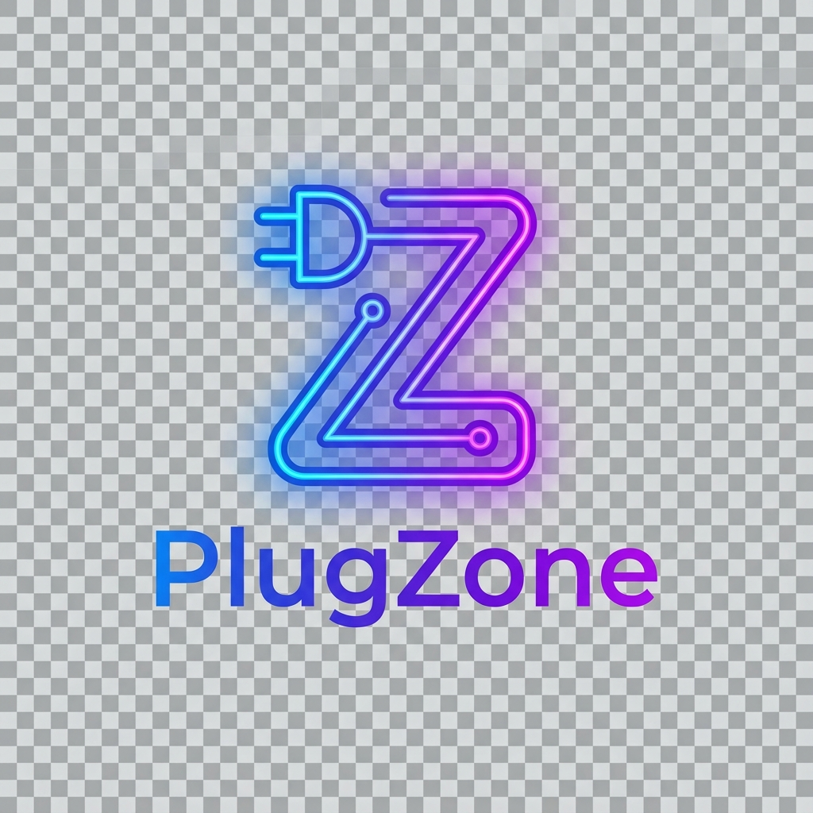

<div align="center">
  <h1>d<a href="docs/INSTALLATION.md"> Installation Guide </a></h1>
</div>

<div align="center">
  
</div>

<div align="center">
  <h1>PlugZone - Monero Marketplace Script</h1>
</div>

<div align="center">
    <h1>Project Status</h1>
</div>

PlugZone is a robust Monero marketplace script.

<div align="center">
    <h1>Introduction</h1>
</div>

The aim of this marketplace script is to facilitate the sale of legal products online as anonymously as possible.

Built with PHP 8.3 and Laravel 11.

[Read our Manifesto](MANIFESTO.md) | [Contributing Guidelines](CONTRIBUTING.md)

<div align="center">
    <h2>Core Features</h2>
</div>

### Monero Integration
- **Vendor Registration Payment**: Monero Wallet RPC integration that generates a wallet address for vendor fee payments.
- **Product Advertising Payment**: Integrated payment system for vendors to advertise their products.
- **Product Purchasing**: Integrated Monero payment system for secure and anonymous product transactions.
- **Return Address System**: Validation for user's Monero return addresses.

### Marketplace Functions
- **User Dashboard**: Comprehensive control panel for account management.
- **Vendor Profiles**: Vendor pages with product listings.
- **Product Management**: Search functionality and wishlist feature.
- **Messaging System**: Secure communication between users.
- **Admin Panel**: Complete administrative control interface.
- **Vendor Panel**: Dedicated interface for vendor operations.
- **Reference System**: Optional referral code requirement for registration.
- **Support System**: Integrated help desk functionality.
- **Disputes System**: Facilitates resolution of order-related issues.

### Security & Privacy
- **Walletless Escrow System**: No user wallets; payments are made per order and escrowed until order resolution.
- **PGP Integration**: Mandatory PGP key confirmation for vendors.
- **Two-Factor Authentication**: Enhanced security through PGP-based 2FA.
- **Mnemonic Recovery**: Built-in mnemonic phrase generation for key recovery.
- **No JavaScript**: Built entirely with pure PHP.
<div align="center">
    <h2>Special thanks goes to @sukunetsiz</h2>
</div>
<div align="center">
    <h1>Screenshots</h1>
</div>

See `docs/` folder for screenshots.

<div align="center">
  <h1><a href="docs/CONNECTING-MONERO-RPC.md">Monero Wallet RPC Guide</a></h1>
</div>

```
Privacy is a human right.
```
